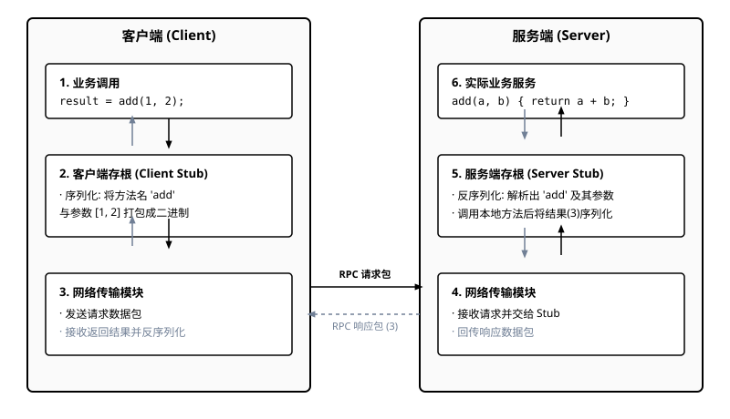
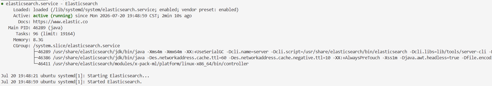
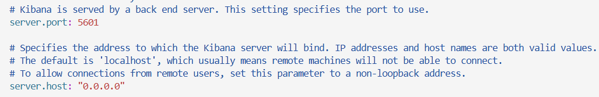
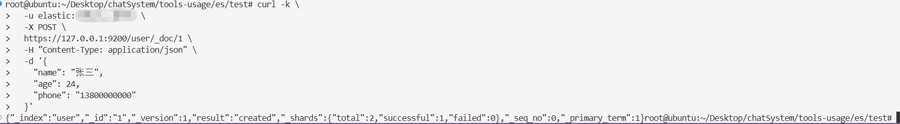
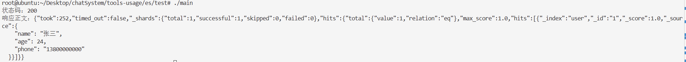
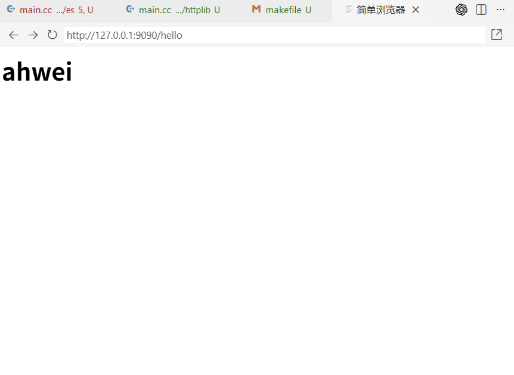
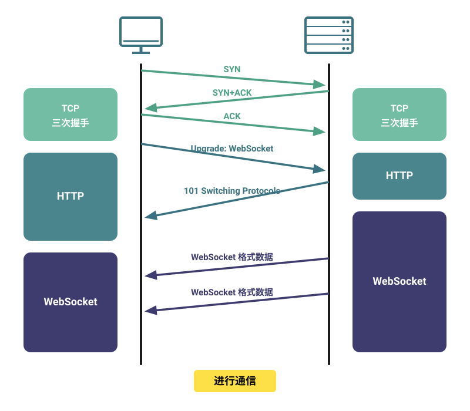
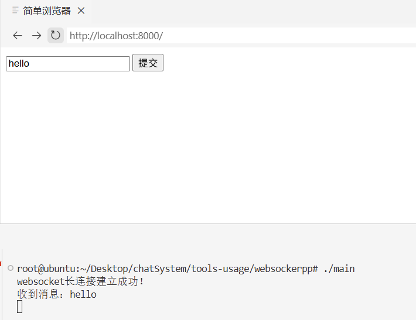
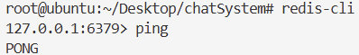
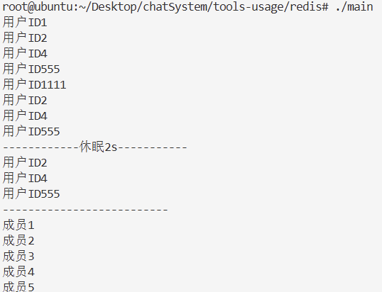

# chatSystem 开发文档

## 一、开发流程

后台服务器实现：

1. 功能需求确定阶段
   1. 要做什么，实现什么项目
   2. 实现这个项目，需要内部拥有哪些功能
2. 设计阶段
   1. 概要框架设计
   2. 功能模块接口设计
3. 技术调研，搭建开发环境阶段
   1. 确定使用哪些技术框架/库，了解他们的基础使用
   2. 将开发环境搭建起来
4. 具体实现阶段
5. 单元测试阶段：确定每一个模块的实现没有问题
6. 系统联调阶段

## 二、功能需求阶段

1. 用户注册
2. 用户登陆
3. 个人信息获取
4. 个人信息修改：
   1. 签名修改
   2. 绑定手机号修改
   3. 头像修改
   4. 昵称修改
5. 手机验证码获取
6. 手机号注册与登录
7. 用户搜索
8. 申请好友
9. 获取好友申请列表
10. 处理好友申请列表
11. 获取聊天会话列表
12. 发送新消息（文本消息，图片消息，语音消息，文件消息）
13. 获取历史消息-按时间
14. 获取最近消息-按条数
15. 关键字消息搜索
16. 文件的上传与下载
17. 语音转文字
18. 创建群聊

## 三、设计阶段

微服务：将一个大的业务拆分为多个子业务，分别在多台不同机器节点上提供对应的服务，由网关服务统一接收多个客户端的各种不同请求，然后将请求分发到不同的子服务节点上进行处理，获取相应后，再转发给客户端。


1. **服务拆分**：将应用程序拆分成多个小型服务，每个服务负责一部分业务功能，具有独立的生命周期和部署。
2. **独立部署**：每个微服务可以独立于其他服务进行部署、更新和扩展。
3. **语言和数据的多样性**：不同的服务可以使用不同的编程语言和数据库，根据服务的特定需求进行技术选型。
4. **轻量级通信**：服务之间通过定义良好的 API 进行通信，通常使用 HTTP/REST、gRPC 等协议。
5. **去中心化治理**：每个服务可以有自己的开发团队，拥有自己的技术栈和开发流程。
6. **弹性和可扩展性**：微服务架构支持服务的动态扩展和收缩，以适应负载的变化。
7. **容错性**：设计时考虑到服务可能会失败，通过断路器、重试机制等手段提高系统的容错性。
8. **去中心化数据管理**：每个服务管理自己的数据库，数据在服务之间是私有的，这有助于保持服务的独立性。
9. **自动化部署**：通过持续集成和持续部署（CI/CD）流程自动化服务的构建、测试和部署。
10. **监控和日志**：对每个服务进行监控和日志记录，以便于跟踪问题和性能瓶颈。
11. **服务发现**：服务实例可能动态变化，需要服务发现机制来动态地找到服务实例。
12. **安全**：每个服务需要考虑安全问题，包括认证、授权和数据传输的安全性。

## 四、环境搭建

### 4.1 gflags

gflags 是 Google 开源的 C++ 命令行参数解析库，专门用来给 C++ 程序灵活解析启动命令行参数，替代 C 语言原生 argc/argv 手动解析参数的繁琐写法。

#### 4.1.1 gflags 的安装

```shell
apt-get install libgflags-dev
```

> 1. 只在终端命令行执行软件：不管哪个系统，直接原名安装
> 2. 运行别人编译好的二进制文件，Ubuntu：装 `libxxx` 运行库；CentOS：普通 `yum install xxx` 自带动态库
> 3. 自己编译 C/C++ 源码：
>    1. Ubuntu：包名 = `lib库名-dev`
>    2. CentOS：包名 = `库名-devel`

#### 4.1.2 gflags 的使用

1. 包含头文件

   ```cpp
   #include <gflags/gflags.h>
   ```
2. 定义参数
   利用 `gflags `提供的宏来定义参数。该宏的三个参数分别为命令行参数名，参数默认值，参数的帮助信息。例如：

   ```c++
   DEFINE_bool(reuse_addr, true, "是否开始网络地址重用选项"); 
   DEFINE_int32(log_level, 1, "日志等级：1-DEBUG, 2-WARN, 3-ERROR"); 
   DEFINE_string(log_file, "stdout", "日志输出位置设置，默认为标准输出");
   ```

   `gflags` 支持定义多种类型的宏函数：

   ```cpp
   DEFINE_bool 
   DEFINE_int32 
   DEFINE_int64 
   DEFINE_uint64 
   DEFINE_double 
   DEFINE_string 
   ```
3. 访问参数

   变量固定前缀 `FLAGS_` + 参数名
4. 不同文件访问参数
   A.cc 定义了 `DEFINE_int32(port, 8080, "xxx");`
   B.cc 要读取它，用 `DECLARE_`：

   ```cpp
   DECLARE_int32(port);
   // 之后就能 FLAGS_port 使用
   ```
5. 初始化参数

   ```cpp
   google::ParseCommandLineFlags(&argc, &argv, true);
   ```
6. 运行参数

   `gflags` 也可以直接在命令行中设置运行参数：

   
7. 配置文件

   [配置文件](./tools-usage/gflags/main.conf) 不需要每次运行的时候都手动收入每个参数的数值，而是通过配置文件，一次编写，永久使用。注意配置文件中不要加多余的空格。

   
8. 特殊参数标识

   gflags也默认为我们提供了几个特殊的标识。

   ```bash
   --help  # 显示文件中所有标识的帮助信息 
   --helpfull  # 和-help 一样, 帮助信息更全面一些 
   --helpshort  # 只显示当前执行文件里的标志 
   --helpxml  # 以 xml 方式打印，方便处理 
   --version  # 打印版本信息，由 google::SetVersionString()设定
   --flagfile  -flagfile=f #从文件 f 中读取命令行参数 
   ```

   例如：

   

### 4.2 gtest

`gtest` 是一个跨平台的 `C++` 单元测试框架

#### 4.2.1 gtest 的安装

```shell
apt-get install libgtest-dev
```

#### 4.2.2 gtest 的使用

1. 包含头文件

   ```cpp
   #include <gtest/gtest.h>
   ```
2. 框架初始化

   ```cpp
   testing::InitGoogleTest(&argc, argv);
   ```
3. 调用测试样例

   ```cpp
   RUN_ALL_TESTS();
   ```
4. TEST 宏

   ```cpp
   TEST(测试名称, 测试样例名称)
   TEST_F(test_fixture,test_name)
   ```

   1. TEST：主要用来创建一个简单测试，它定义了一个测试函数，在这个函数中可以使用任何C++代码并且使用框架提供的断言进行检查
   2. TEST_F：主要用来进行多样测试，适用于多个测试场景如果需要相同的数据配置的情况，即相同的数据测不同的行为
5. 断言宏

   GTest 中的断言宏可以分为两类：

   * `ASSERT_`系列：如果当前检测点失败，则直接退出当前测试用例函数
   * `EXPECT_`系列：如果当前检测点失败，仅打印错误信息，继续向后执行剩余代码

   ```cpp
   // bool 值检查
   ASSERT_TRUE(参数);  // 期待表达式结果为 true
   ASSERT_FALSE(参数); // 期待表达式结果为 false
   
   // 数值型数据检查
   ASSERT_EQ(参数1, 参数2);  // equal，两个值相等才判定通过
   ASSERT_NE(参数1, 参数2);  // not equal，两个值不相等才判定通过
   ASSERT_LT(参数1, 参数2);  // less than，参数1 < 参数2 才判定通过
   ASSERT_GT(参数1, 参数2);  // greater than，参数1 > 参数2 才判定通过
   ASSERT_LE(参数1, 参数2);  // less equal，参数1 ≤ 参数2 才判定通过
   ASSERT_GE(参数1, 参数2);  // greater equal，参数1 ≥ 参数2 才判定通过
   ```

示例：

```cpp
#include <gtest/gtest.h> 

int Add(int a, int b) 
{
    return a + b;
}
int Sub(int a, int b) 
{
    return a - b;
}
// TEST(测试名称, 测试用例名称)
TEST(MathTest, TestAdd) 
{
    EXPECT_EQ(Add(1,2), 3);
    ASSERT_EQ(Add(-1, 1), 0);
}

TEST(MathTest, TestSub) 
{
    EXPECT_EQ(Sub(5,3), 2);
    EXPECT_EQ(Sub(2,7), -5);
}

TEST(StrTest, StrCmp)
{
    std::string str = "ahwei";
    ASSERT_EQ(str, "Ahwei");
    ASSERT_EQ(str, "ahwei");
}

int main (int argc, char* argv[])
{
    // 单元测试框架的初始化
    testing::InitGoogleTest(&argc, argv);
    // 开始所有的单元测试
    return RUN_ALL_TESTS(); 
}
```

运行结果如下：


### 4.3 Spdlog

高性能异步日志库

> * 同步日志：调用打印日志的代码时，当前线程立即执行磁盘写入、控制台 IO 操作，IO 没写完，业务代码就卡在这里等着，不能继续往下跑；
> * 异步日志：调用日志接口只把日志字符串丢进内存队列，立刻返回，业务线程马上继续执行业务逻辑。后台独立日志线程专门负责把队列里的日志批量写到文件或控制台，业务线程不用等待 IO。（生产者-消费者模型）

#### 4.3.1 Spdlog 的安装

```powershell
apt-get install libgtest-dev
```

#### 4.3.2 Spdlog 的使用

- 标准输出

  ```cpp
  #include <spdlog/spdlog.h>
  #include <spdlog/sinks/stdout_color_sinks.h>
  #include <iostream>
  
  int main()
  {
      // 设置全局的刷新策略
      spdlog::flush_every(std::chrono::seconds(1));       // 每秒刷新
      spdlog::flush_on(spdlog::level::level_enum::debug); // 遇到debug以上等级立即刷新
      // 设置全局的日志输出等级（每个日志器还可以独立进行设置）
      spdlog::set_level(spdlog::level::level_enum::debug);
  
      // 创建同步日志器（工厂接口默认创建的就是同步日志器）
      auto logger = spdlog::stdout_color_mt("default-logger");       // 标准输出
      // 设置日志器的刷新策略，以及日志器的输出等级
      logger->flush_on(spdlog::level::level_enum::debug);
      logger->set_level(spdlog::level::level_enum::debug);
  
      // 设置日志输出格式
      logger->set_pattern("[%n][%H:%M:%S][%t][%-8l] %v"); // -8：格式化对齐规则：左对齐，固定占 8 个字符宽度
      // 进行简单的日志输出
      logger->trace("你好！{}", "ahwei");
      logger->debug("你好！{}", "ahwei");
      logger->info("你好！{}", "ahwei");
      logger->warn("你好！{}", "ahwei");
      logger->error("你好！{}", "ahwei");
      logger->critical("你好！{}", "ahwei");
      std::cout << "log done!" << std::endl;
  
      return 0;
  }
  ```

  
- 输出到文件

  ```cpp
  #include <spdlog/spdlog.h>
  #include <spdlog/sinks/stdout_color_sinks.h>
  #include <spdlog/sinks/basic_file_sink.h>
  #include <iostream>
  
  int main()
  {
      // 设置全局的刷新策略
      spdlog::flush_every(std::chrono::seconds(1));       // 每秒刷新
      spdlog::flush_on(spdlog::level::level_enum::debug); // 遇到debug以上等级立即刷新
      // 设置全局的日志输出等级（每个日志器还可以独立进行设置）
      spdlog::set_level(spdlog::level::level_enum::debug);
  
      // 创建同步日志器（工厂接口默认创建的就是同步日志器）
      // auto logger = spdlog::stdout_color_mt("default-logger");       // 标准输出
      auto logger = spdlog::basic_logger_mt("file-logger", "sync.log"); // 普通文件
      // 设置日志器的刷新策略，以及日志器的输出等级
      logger->flush_on(spdlog::level::level_enum::debug);
      logger->set_level(spdlog::level::level_enum::debug);
  
      // 设置日志输出格式
      logger->set_pattern("[%n][%H:%M:%S][%t][%-8l] %v"); // -8：格式化对齐规则：左对齐，固定占 8 个字符宽度
      // 进行简单的日志输出
      logger->trace("你好！{}", "ahwei");
      logger->debug("你好！{}", "ahwei");
      logger->info("你好！{}", "ahwei");
      logger->warn("你好！{}", "ahwei");
      logger->error("你好！{}", "ahwei");
      logger->critical("你好！{}", "ahwei");
      std::cout << "log done!" << std::endl;
  
      return 0;
  }
  ```

  
- 异步工厂

  ```cpp
  #include <spdlog/spdlog.h>
  #include <spdlog/sinks/stdout_color_sinks.h>
  #include <spdlog/sinks/basic_file_sink.h>
  #include <spdlog/async.h>
  #include <iostream>
  
  int main()
  {
      // 设置全局的刷新策略
      spdlog::flush_every(std::chrono::seconds(1));       // 每秒刷新
      spdlog::flush_on(spdlog::level::level_enum::debug); // 遇到debug以上等级立即刷新
      // 设置全局的日志输出等级（每个日志器还可以独立进行设置）
      spdlog::set_level(spdlog::level::level_enum::debug);
  
      // 创建异步日志器
      auto logger = spdlog::stdout_color_mt<spdlog::async_factory>("async-logger");       // 标准输出
      // 设置日志器的刷新策略，以及日志器的输出等级
      logger->flush_on(spdlog::level::level_enum::debug);
      logger->set_level(spdlog::level::level_enum::debug);
  
      // 设置日志输出格式
      logger->set_pattern("[%n][%H:%M:%S][%t][%-8l] %v"); // -8：格式化对齐规则：左对齐，固定占 8 个字符宽度
      // 进行简单的日志输出
      logger->trace("你好！{}", "ahwei");
      logger->debug("你好！{}", "ahwei");
      logger->info("你好！{}", "ahwei");
      logger->warn("你好！{}", "ahwei");
      logger->error("你好！{}", "ahwei");
      logger->critical("你好！{}", "ahwei");
      std::cout << "log done!" << std::endl;
  
      return 0;
  }
  ```

  可以看到先输出日志打印完毕，后输出日志：

  

#### 4.3.3 Spdlog 的二次封装

原因：

1. 避免单例模式的锁冲突，因此直接创建全局的线程安全的日志器进行使用
2. 因为日志输出没有文件名行号，因此使用宏进行二次封装输出日志的文件名和行号
3. 封装一个初始化接口，便于使用：调试模式则输出到标准输出，否则输出到文件中
   思想：
4. 封装一个全局接口，用户日志器的创建与初始化
   - 初始化接口接收一个参数：运行模式-`bool`
   - 初始化接口接收一个参数：输出文件名-用于发布模式
   - 初始化接口接收一个参数：输出日志等级-用于发布模式
5. 对日志输出的接口，进行宏的封装，加入文件名行号的输出

logger.hpp:

```cpp
#include <spdlog/spdlog.h>
#include <spdlog/sinks/stdout_color_sinks.h>
#include <spdlog/sinks/basic_file_sink.h>
#include <spdlog/async.h>
#include <iostream>

std::shared_ptr<spdlog::logger> g_default_logger;

// mode - 运行模式： true-发布模式； false-调试模式
void init_logger(bool mode, const std::string &file, int level) 
{
    // 如果是调试模式，则创建标准输出日志器，输出等级为最低
    if (mode == false)
    {
        g_default_logger = spdlog::stdout_color_mt("default_logger");
        g_default_logger->set_level(spdlog::level::level_enum::trace);
        g_default_logger->flush_on(spdlog::level::level_enum::trace);
    }
    // 否则是发布模式，则创建文件输出日志器，输出等级根据参数而定
    else
    {
        g_default_logger = spdlog::basic_logger_mt("default_logger", file);
        g_default_logger->set_level((spdlog::level::level_enum)level);
        g_default_logger->flush_on((spdlog::level::level_enum)level);
    }
    g_default_logger->set_pattern("[%n][%H:%M:%S][%t][%-8l]%v"); 
}

#define LOG_TRACE(format, ...) g_default_logger->trace(std::string("[{}:{}] ") + format, __FILE__, __LINE__, ##__VA_ARGS__)
#define LOG_DEBUG(format, ...) g_default_logger->debug(std::string("[{}:{}] ") + format, __FILE__, __LINE__, ##__VA_ARGS__)
#define LOG_INFO(format, ...) g_default_logger->info(std::string("[{}:{}] ") + format, __FILE__, __LINE__, ##__VA_ARGS__)
#define LOG_WARN(format, ...) g_default_logger->warn(std::string("[{}:{}] ") + format, __FILE__, __LINE__, ##__VA_ARGS__)
#define LOG_ERROR(format, ...) g_default_logger->error(std::string("[{}:{}] ") + format, __FILE__, __LINE__, ##__VA_ARGS__)
#define LOG_FATAL(format, ...) g_default_logger->critical(std::string("[{}:{}] ") + format, __FILE__, __LINE__, ##__VA_ARGS__)
```

main.cc:

```cpp
#include "logger.hpp"
#include <gflags/gflags.h>

DEFINE_bool(run_mode, false, "程序的运行模式，false-调试；true-发布");
DEFINE_string(log_file, "", "发布模式下，用于指定日志输出文件");
DEFINE_int32(log_level, 0, "发布模式下，用于指定日志输出等级");
int main(int argc, char* argv[])
{
    google::ParseCommandLineFlags(&argc, &argv, true);
    init_logger(FLAGS_run_mode, FLAGS_log_file, FLAGS_log_level);

    LOG_DEBUG("启动成功！");
    LOG_INFO("用户名：{}", "ahwei");
    LOG_WARN("用户名：{}，性别：{}", "ahwei", "男");
    LOG_ERROR("hello: {}", "ahwei");
    LOG_FATAL("hello: {}", "ahwei");

    return 0;
}
```


### 4.4 etcd

Etcd 是一个分布式、高可用的一致性键值存储系统，用于配置共享和服务发现等。使用 Raft 一致性算法来保持集群数据的一致性，且客户端通过长连接 watch 功能，能够及时收到数据变化通知。

- Lease 租约 + KeepAlive 心跳：实现临时节点自动清理，服务宕机自动注销注册信息；
- 分布式锁：基于 CAS 原子事务实现，搭配租约避免死锁；
- 事务、版本控制：支持条件原子写入、历史数据回滚。

> 长连接：客户端和服务器建立一次 `TCP` 连接后，不马上断开，而是把这条连接保持一段时间，后续多次请求或数据传输都复用同一条连接。
>
> - 短连接：每次通信都要 `建立连接 -> 传输数据 -> 断开连接`
> - 长连接：一次建立连接后，多次传数据，空闲时暂时保持连接
>   它的优点是：减少频繁三次握手和四次挥手的开销；降低延迟；适合频繁通信、实时通信场景
>   他的缺点是：服务器要长期维护连接，占用文件描述符、内存等资源；连接空闲太久可能被防火墙、NAT、负载均衡器断掉；通常需要心跳机制来检测连接是否还或者

> 心跳：定期确认对方还活着，如果连续几次没回应，就认为连接断了，然后重连

> 租约：`key + TTL`。租约是 etcd 里的概念。比如给 `/chat/gateway/1` 绑定一个 10 秒租约，如果 10 秒内没有续租，`etcd` 会自动删除这个 `key`。

> ```
> 客户端 <--WebSocket 心跳--> 聊天服务器 <--租约 keepalive--> etcd
> ```

#### 4.4.1 etcd 的安装

1. 安装

   ```bash
   # 1. 下载etcd 3.5.21 amd64
   wget https://github.com/etcd-io/etcd/releases/download/v3.5.21/etcd-v3.5.21-linux-amd64.tar.gz
   
   # 2. 解压
   tar -zxvf etcd-v3.5.21-linux-amd64.tar.gz -C /usr/local/
   
   # 3. 把二进制放入系统PATH
   cd /usr/local/etcd-v3.5.21-linux-amd64
   cp etcd etcdctl /usr/local/bin/
   
   # 4. 验证安装
   etcd --version
   etcdctl version
   ```
2. 启动 Etcd 服务：

   ```bash
   systemctl start etcd
   ```

   > 开启的时候我这里报错了：
   >
   > 
   >
   > 这个报错的意思是：etcd 二进制已经安装了，但系统里没有注册 etcd.service，所以 systemctl start etcd 找不到服务单元。
   > 可以先确认路径：`which etcd`
   > 输出是 `/usr/local/bin/etcd`，可以手动创建 systemd 服务：
   >
   > ```
   > mkdir -p /var/lib/etcd
   >
   > cat >/etc/systemd/system/etcd.service <<'EOF'
   > [Unit]
   > Description=etcd key-value store
   > Documentation=https://etcd.io/docs/
   > After=network-online.target
   > Wants=network-online.target
   >
   > [Service]
   > Type=notify
   > ExecStart=/usr/local/bin/etcd \
   >   --name default \
   >   --data-dir /var/lib/etcd \
   >   --listen-client-urls http://0.0.0.0:2379 \
   >   --advertise-client-urls http://127.0.0.1:2379 \
   >   --listen-peer-urls http://127.0.0.1:2380 \
   >   --initial-advertise-peer-urls http://127.0.0.1:2380 \
   >   --initial-cluster default=http://127.0.0.1:2380 \
   >   --initial-cluster-state new
   > Restart=always
   > RestartSec=5
   > LimitNOFILE=40000
   >
   > [Install]
   > WantedBy=multi-user.target
   > EOF
   > ```
   >
3. 设置 Etcd 开机自启：

   ```bash
   systemctl enable etcd
   ```
4. 运行验证：

   ```bash
   etcdctl put mykey "wjw" 
   etcdctl get mykey
   etcdctl del mykey
   ```

#### 4.4.2 搭建服务注册发现中心

使用 Etcd 作为服务注册发现中心，需要定义服务的注册和发现逻辑，这通常涉及到以下几个操作：

1. 服务注册：服务启动时，向 Etcd 注册自己的地址和端口
2. 服务发现：客户端通过 Etcd 获取服务的地址和窗口，用于远程调试
3. 健康检查：服务定期向 Etcd 发送心跳，以维持其注册信息的有效性

etcd 采用 golang 编写， v3 版本通信采用 grpc API，即（HTTP2 + protobuf），官方只维护了 go 语言版本的 client 库，因此需要找到 C/C++ 非官方的 client 开发库 `etcd-cpp-apiv3`

```bash
git clone https://github.com/etcd-cpp-apiv3/etcd-cpp-apiv3.git 
cd etcd-cpp-apiv3 
mkdir build && cd build 
 
cmake .. -DCMAKE_INSTALL_PREFIX=/usr 
make -j$(nproc) && sudo make install 
```

#### 4.4.3 etcd 的二次封装

[代码位于](./tools-usage/etcd)


封装 `etcd-cpp-apiv3`，实现两种类型的客户端

1. 服务注册客户端：向服务器新增服务信息数据，并进行保活
2. 服务发现客户端：从服务器查找服务信息数据，并进行改变事件监控

> 保活：不断告诉 `etcd`，这个租约还活着，不要把他绑定的 `key` 删除
>
> ```cpp
> auto keep_alive = client.leasekeepalive(3).get();
> auto lease_id = keep_alive->Lease();
> client.put("/service/user", "127.0.0.1:8080", lease_id).get();
> ```
>
> 意思是：这个 `/service/user` 不是永久 `key`，它绑定到了一个 3 秒租约上。如果没有保活，那么 3 秒后 `etcd` 会自动删除这个 `key`。但 `leasekeepalive(3)` 会在后台持续续约

封装思想：

1. 封装服务注册客户端类 `Registry`：把当前服务注册到 `etcd`
   提供一个接口：向服务器新增数据并进行保活
   参数：注册中心地址（`etcd` 服务器地址），新增的服务信息（服务名-主机键值对）
2. 封装服务发现客户端类 `Discovery`：从 `etcd` 发现服务，并监听服务上下线
   提供两个设置回调函数的接口：服务上线事件接口（新增数据），服务下线事件接口（数据删除）
   提供一个设置根目录的接口：用于获取指定目录下的数据以及监控目录下数据的改变

`Registry`：服务注册

```cpp
Registry(const std::string &host)
    : _client(std::make_shared<etcd::Client>(host)),
      _keep_alive(_client->leasekeepalive(3).get()),
      _lease_id(_keep_alive->Lease()) {}
```

- `_client = etcd 客户端`
- 连接 etcd，比如：`http://127.0.0.1:2379`
- `_keep_alive = 创建一个 3 秒续约一次的租约`

etcd 里的 key 可以绑定租约。租约一直续期，key 就一直存在；进程挂了，续约停止，key 过期后自动删除。

```cpp
_lease_id = 拿到这个租约 id
```

注册服务：

```cpp
bool registry(const std::string &key, const std::string &val)
{
    auto resp = _client->put(key, val, _lease_id).get();
```

注册服务是把一条数据写入 `etcd`

```
key = /service/user/instance1
val = 127.0.0.1:8080
lease = _lease_id
```

所以 `etcd` 中存的是：

```cpp
/service/user/instance1 -> 127.0.0.1:8080
```

并且这条数据绑定了租约。如果服务程序退出，析构函数执行：

```cpp
~Registry() { _keep_alive->Cancel(); }
```

取消续约，过一会儿 etcd 会自动删除这个服务节点。

`Discovery`：服务发现

构造函数：

```cpp
Discovery(host, basedir, put_cb, del_cb)
// host      etcd 地址
// basedir   要监听的服务根目录，比如 /service
// put_cb    有服务上线时调用的函数
// del_cb    有服务下线时调用的函数
```

先获取当前已经存在的服务：

```cpp
auto resp = _client->ls(basedir).get();
```

比如 `etcd` 当前有：

```text
/service/user/instance1 -> 127.0.0.1:8080
/service/order/instance1 -> 127.0.0.1:8081
```

然后遍历：

```cpp
for (int i = 0; i < sz; ++i)
{
    if (_put_cb)
        _put_cb(resp.key(i), resp.value(i).as_string());
}
```

等价于：把当前已有服务都当作“上线服务”通知一遍。

接着创建 `watcher`：监听 `basedir` 目录下的变化，比如 `/service`。

```cpp
_watcher = std::make_shared<etcd::Watcher>(
    *_client.get(),
    basedir,
    std::bind(&Discovery::callback, this, std::placeholders::_1),
    true
);
```

只要 etcd 里发生：

```text
新增 key
修改 key
删除 key
```

就调用：

```cpp
Discovery::callback(...)
```

最后一个 `true` 一般表示递归监听，也就是 `/service` 下面的子路径也会监听到。

`callback`：处理服务上下线

```cpp
void callback(const etcd::Response &resp)
```

每次 `etcd` 有事件通知时，会进入这个函数。
如果是 `PUT`：

```cpp
if (ev.event_type() == etcd::Event::EventType::PUT)
{
    _put_cb(ev.kv().key(), ev.kv().as_string());
}
```

表示有服务上线或服务信息更新。

比如注册端写入：

```cpp
/service/user/instance1 -> 127.0.0.1:8080
```

发现端就会调用：

```cpp
online("/service/user/instance1", "127.0.0.1:8080");
```

如果是 `DELETE`：

```cpp
else if (ev.event_type() == etcd::Event::EventType::DELETE_)
{
    _del_cb(ev.prev_kv().key(), ev.prev_kv().as_string());
}
```

表示服务下线。比如注册程序退出，租约过期，`etcd` 删除：

```cpp
/service/user/instance1
```

发现端就会调用：

```cpp
offline("/service/user/instance1", "127.0.0.1:8080");
```

### 4.5 brpc

brpc 是用 C++ 语言编写的工业级 PRC 框架，常用于搜索、存储、机器学习、广告、推荐等高性能系统。

rpc 是一个远程调用框架，以加法计算为例，以前都是将数据处理过程直接在本地封装实现：

```cpp
int Add (int num1, int num2)
{
   return num1 + num2;
}
```

而 rpc 框架远程调用思想不一样，它将数据处理过程交给服务器来进行：



#### 4.5.1 brpc 的安装

安装系统依赖：
```bash
apt-get install -y git g++ make libssl-dev libprotobuf-dev libprotoc-dev protobuf-compiler libleveldb-dev
```

编译安装 brpc：
```bash
git clone https://github.com/apache/brpc.git
cd brpc
mkdir build && cd build
cmake .. -DCMAKE_INSTALL_PREFIX=/usr .. && cmake --build . -j6
make && make install
```

#### 4.5.2 brpc 类与接口的说明
##### 4.5.2.1 日志输出类

头文件：`#include <butil/logging.h>`

```cpp
namespace logging
{
    // 我们并不需要它自带的日志输出，所以这里要关闭日志
    enum LoggingDestination
    {
        LOG_TO_NONE = 0
    };
    struct BUTIL_EXPORT LoggingSettings
    {
        LoggingSettings();
        LoggingDestination logging_dest;
    };
    // 初始化日志配置
    bool InitLogging(const LoggingSettings &settings);
}
```

##### 4.5.2.2 Protobuf 基础接口

```proto
syntax="proto3"; // proto 版本

package example; // 声明命名空间（由 protobuf 生成的代码可能会和其他代码冲突，比如类名，这里 package 就是最后 C++ 的命名空间

option cc_generic_services = true; // 为 service 生成 C++ 服务类代码。

// 类似于 C++ 中的结构体，字段编号1是 protobuf 序列化时用的字段标识。网络传输时 protobuf 不直接靠字段名找数据，而是靠这个编号。
message EchoRequest {
    string message = 1;
}

message EchoResponse {
    string message = 1;
}

// 定义了一个 PRC 服务，理解为 C++ 里的抽象类
// class EchoService {
// public:
//     virtual EchoResponse Echo(EchoRequest request) = 0;
// };
service EchoService {
    rpc Echo(EchoRequest) returns (EchoResponse);
}
```

然后执行以下命令生成 [`main.pb.cc`](./tools-usage/brpc/main.pb.cc) 和 [`main.pb.h`](./tools-usage/brpc/main.pb.h) 两个文件。
```bash
protoc --cpp_out=./ main.proto 
```

##### 4.5.2.3 服务端核心类
```cpp
namespace brpc {
// 服务配置项
struct ServerOptions {
    // 空闲连接超时，-1代表不关闭
    int idle_timeout_sec;
    // 工作线程数，默认等于CPU核心数
    int num_threads;
};

// 服务所有权枚举
enum ServiceOwnership {
    // 服务销毁由Server管理
    SERVER_OWNS_SERVICE,
    // 外部自行管理服务对象生命周期
    SERVER_DOESNT_OWN_SERVICE
};

// 服务主类
class Server {
    // 注册服务
    int AddService(google::protobuf::Service* service, ServiceOwnership ownership);
    // 启动服务，监听端口
    int Start(int port, const ServerOptions* opt);
    // 停止服务
    int Stop(int closewait_ms);
    // 等待服务退出
    int Join();
    // 阻塞运行，直到收到退出信号
    void RunUntilAskedToQuit();
};

// 自动执行done->Run的RAII守卫
class ClosureGuard {
    explicit ClosureGuard(google::protobuf::Closure* done);
    ~ClosureGuard() { if (_done) _done->Run(); }
};

// HTTP头部封装
class HttpHeader {
    void set_content_type(const std::string& type);
    const std::string* GetHeader(const std::string& key);
    void SetHeader(const std::string& key, const std::string& value);
    const URI& uri() const;
    HttpMethod method() const;
    void set_method(const HttpMethod method);
    int status_code();
    void set_status_code(int status_code);
};

// RPC控制器（扩展原生protobuf Controller）
class Controller : public google::protobuf::RpcController {
    // 设置请求超时ms
    void set_timeout_ms(int64_t timeout_ms);
    // 设置最大重试次数
    void set_max_retry(int max_retry);
    google::protobuf::Message* response();
    HttpHeader& http_response();
    HttpHeader& http_request();
    bool Failed();
    std::string ErrorText();

    // RPC响应完成后的后置回调
    using AfterRpcRespFnType = std::function<void(Controller* cntl, const google::protobuf::Message* req, const google::protobuf::Message* res)>;
    void set_after_rpc_resp_fn(AfterRpcRespFnType&& fn);
};
}
```

##### 4.5.2.4 客户端核心类
```cpp
namespace brpc {
// Channel通道配置
struct ChannelOptions {
    // 连接超时ms，默认200
    int32_t connect_timeout_ms;
    // RPC请求超时ms，默认500
    int32_t timeout_ms;
    // 最大重试次数，默认3
    int max_retry;
    // 协议类型，默认baidu_std
    AdaptiveProtocolType protocol;
};

// 通信通道
class Channel : public ChannelBase {
    // 初始化通道，传入服务地址+端口
    int Init(const char* server_addr_and_port, const ChannelOptions* options);
};
}
```

#### 4.5.3 RPC 调用实现样例
[服务端：](./tools-usage/brpc/server.cc)

1. 创建 rpc 服务子类继承 pb 中的 EchoService 服务类，并实现内部的业务接口逻辑
2. 创建 rpc 服务器类，搭建服务器 
3. 向服务器类中添加 rpc 子服务对象，告诉服务器收到什么请求用哪个接口处理
4. 启动服务器

[客户端：](./tools-usage/brpc/client.cc)
1. 创建网络通信信道
2. 实例化 pb 中的 Echo_Service_Stub 类对象
3. 发起 rpc 请求，获取响应进行处理


#### 4.5.4 brpc 二次封装
brpc 本质上来说是 rpc 调用，但是向谁调用什么服务得管理起来——搭配 etcd 实现注册中心管理（通过注册中心，能够获知谁能提供什么服务，进而能够连接它发起这个服务调用）

封装思想：主要是管理起来网络通信的信道——将不同服务节点主机的通信信道管理起来。封装的是服务节点信道的管理，而不是 rpc 调用的管理

封装：

1. 指定服务的信道管理类：
   - 一个服务可能会有多个节点提供服务，每个节点都有自己的 channel
   - 建立服务与信道的映射关系，并且关系是一对多，采用 RR 轮转策略进行获取
2. 总体的服务信道管理类
   - 将多个服务的信道管理对象管理起来


#### 4.5.5 brpc 和 etcd 联调


### 4.6 es

Elasticsearch 是一个分布式搜索与分析引擎。它的主要功能是存储和搜索，文档经过分词、倒排索引后写入数据库，查询时使用相同分词器分词，通过倒排索引找到候选文档，然后计算相关度分数并排序返回。

#### 4.6.1 es 的安装
```bash
echo "deb [trusted=yes] https://mirrors.tuna.tsinghua.edu.cn/elasticstack/8.x/apt/ stable main" | sudo tee /etc/apt/sources.list.d/elastic-8.x.list

sudo apt-get update
sudo apt-get install -y elasticsearch
```

安装好后启动：
```bash
sudo systemctl daemon-reload
sudo systemctl enable --now elasticsearch.service
sudo systemctl status elasticsearch.service
```



验证安装 es


设置密码：
```bash
/usr/share/elasticsearch/bin/elasticsearch-reset-password -u elastic -i
```

安装 ik 分词器插件，注意，插件的版本号必须和上面 es 的版本号一致。

> 由于网络原因，我是在 github 上下载好压缩包后上传服务器解压安装的
> ```bash
> /usr/share/elasticsearch/bin/elasticsearch-plugin install --batch file:///root/Desktop/chatSystem/elasticsearch-analysis-ik-8.19.16.zip
> ```
>
> 安装完成后重启 es：`systemctl restart elasticsearch`


设置外网访问：如果新配置完成的话，默认只能在本机进行访问：

```shell
vim vim /etc/elasticsearch/elasticsearch.yml

# 新增配置
network.host: 0.0.0.0
http.port: 9200
cluster.initial_master_nodes: ["node-1"]
```

安装 `kibana`
```shell
apt install kibana
```

配置kibana
```shell
vim /etc/kibana/kibana.yml
```



```shell
# 启动 kibana
systemctl start kibana 
# 设置开机自启
systemctl enable kibana
# 验证安装
systemctl status kibana
```

es 客户端的安装

```shell
# 安装 MicroHTTPD 库 
apt-get install libmicrohttpd-dev

# 克隆代码
git clone https://github.com/seznam/elasticlient

# 切换目录
cd elasticlient

# 更新子模块
git submodule update --init --recursive

cmake .. \
    -DCMAKE_INSTALL_PREFIX=/usr \
    -DUSE_SYSTEM_CURL=ON \
    -DBUILD_CPR_TESTS=OFF \
    -DBUILD_ELASTICLIENT_TESTS=OFF \
    -DBUILD_ELASTICLIENT_EXAMPLE=OFF

# 编译
make -j"$(nproc)"

# 安装
make install
```

#### 4.6.2 es 的核心概念
Elasticsearch 存储数据的结构可以记成：

```
集群 Cluster
└── 索引 Index
    ├── 映射 Mapping
    ├── 文档 Document
    │   ├── 字段 Field
    │   ├── 字段 Field
    │   └── 字段 Field
    └── 文档 Document
```

以聊天系统为例：
```
索引：chat_messages

文档1：
{
  "sender_id": "user_001",
  "content": "你好，Elasticsearch",
  "sent_at": "2026-07-20T20:00:00+08:00"
}

文档2：
{
  "sender_id": "user_002",
  "content": "C++ 如何连接 Elasticsearch",
  "sent_at": "2026-07-20T20:01:00+08:00"
}
```

其中：
```
chat_messages                  → 索引
一整条 JSON                    → 文档
sender_id、content、sent_at    → 字段
字段的数据类型和搜索规则       → Mapping
```

- 索引（Index）：一组用途相近的文档。
- 文档（Document） ：文档就是一条 JSON 数据，相当于数据库中的一行。
- 字段（Field）：字段就是 JSON 的一个属性。其中字符转类型：
  - text：用于全文搜索，会经过哦分词器处理。
  - keyword：用完整词匹配，不进行分词。
- 映射（mapping） ：Mapping 相当于告诉 Elasticsearch：哪些字段需要分词，做出索引映射，能够进行数据检索。

```json
POST /user/_doc 
{
  "settings": {
    "analysis": {
      "analyzer": {  # 自定义分词器
        "ik": {  # 自定义ik中文分词器
          "tokenizer": "ik_max_word"  # ik_max_word：最大粒度分词，拆分尽可能多词汇
        }
      }
    }
  },
  "mappings": {
    "dynamic": true,  # 开启动态映射，新增字段自动识别类型
    "properties": {
      "nickname": {  # 昵称
        "type": "text",  # 文本类型，支持分词检索
        "analyzer": "ik_max_word"  # 使用ik中文分词器分词
      },
      "user_id": {  # 用户ID
        "type": "keyword",  # 关键字类型，不分词，完整精确匹配
        "analyzer": "standard"  # ES默认标准分词器（keyword字段实际不生效）
      },
      "phone": {  # 手机号
        "type": "keyword",  # 关键字类型，完整匹配手机号
        "analyzer": "standard"
      },
      "description": {  # 描述
        "type": "text",  # 文本类型
        "enabled": false  # 仅存储字段值，不构建索引、无法检索
      },
      "avatar_id": {  # 头像ID
        "type": "keyword",
        "enabled": false  # 仅存储，不参与检索查询
      }
    }
  }
}
```

#### 4.6.3 es 客户端接口介绍

ES 本质上提供的是 HTTP REST 接口，elasticlient 完成 HTTP 请求。用 JsonCpp 构造请求正文，并解析 ES 返回的 JSON

- 创建 ES 客户端对象

  使用 `elasticlient::Client` 的构造函数：
  ```cpp
  #include <elasticlient/client.h>

  elasticlient::Client client({
      "http://127.0.0.1:9200/"
  });
  ```

  也可以传多个 ES 节点：客户端会在节点之间尝试请求，所有节点都无法连结时，会抛异常
  ```cpp
  elasticlient::Client client({
    "http://192.168.1.101:9200/",
    "http://192.168.1.102:9200/",
    "http://192.168.1.103:9200/"
  });
  ```
  还可以带超时时间：
  ```cpp
  elasticlient::Client client(
    {"http://127.0.0.1:9200/"},
    6000
  );
  ```

- 四个客户端接口：
  
  以下四个接口均返回 `cpr::Response`。`response.status_code` 可以获取 HTTP状态码；`response.text` 可以获取 ES 返回的 JSON 字符串
  
  - search：条件搜索
    ```cpp
    cpr::Response search(
    const std::string& indexName, 	//  ES 索引名
    const std::string& docType,		// 文档类型，ES 7 中通常写 "_doc"
    const std::string& body,		// 查询 JSON 字符串
    const std::string& routing = "" // 自定义路由，一般不传
    );
    ```
    
  - get：根据 `_id` 查询文档
    ```cpp
    cpr::Response get(
      const std::string& indexName,
      const std::string& docType,
      const std::string& id = "",
      const std::string& routing = ""
    );
    ```
    
    ```cpp
    cpr::Response response = client.get("user", "_doc", "1");
    // GET /user/_doc/1
    ```
    
  - index：新增或覆盖文档（不存在，新增；存在，覆盖）
    
    ```cpp
    cpr::Response index(
        const std::string& indexName,
        const std::string& docType,
        const std::string& id,
        const std::string& body,
        const std::string& routing = ""
    );
    ```
    
    ```cpp
    cpr::Response response = client.index("user", "_doc", "1", body);
    // 大致对应：PUT /user/_doc/1
    ```
    
  - remove：根据 _id 删除文档
    
    ```cpp
    cpr::Response remove(
    const std::string& indexName,
    const std::string& docType,
    const std::string& id,
    const std::string& routing = ""
    );
    ```
    
    ```cpp
    cpr::Response response = client.remove("user", "_doc", "1");
    // DELETE /user/_doc/
    ```
  
- JsonCpp 的作用：

  静态查询可以直接使用原始字符串：`R"( ... )"` 是 C++ 原始字符串。但是实际情况中，查询条件通常来自变量，手工拼接 JSON 很危险，因此使用 JsonCpp。

  - `Json::Value`

    他是一个能同时表示以下类型的万能 JSON 节点：JSON对象、JSON数组、字符串、整数、浮点数、布尔值、null

    使用时包含 `\#include <jsoncpp/json/json.h>` 头文件

    1. 创建 JSON 对象

       ```cpp
       // 目标 Json
       // {
       //   "name": "张三",
       //   "age": 24,
       //   "score": 88.5,
       //   "enabled": true
       // }
       ```

    2. 创建嵌套对象

       ```cpp
       // 目标 Json
       // {
       //   "query": {
       //     "match": {
       //       "nickname": "张三"
       //     }
       //   }
       // }
       
       // 可以连续直接使用 []
       Json::Value root;
       
       root["name"] = "张三";
       root["age"] = 24;
       root["score"] = 88.5;
       root["enabled"] = true;
       
       // 等价于逐层构造
       // 实际开发中，较复杂的结构建议分层构造，可读性更好。
       Json::Value match;
       match["nickname"] = "张三";
       
       Json::Value query;
       query["match"] = match;
       
       Json::Value root;
       root["query"] = query;
       ```

    3. 创建数组

       ```cpp
       // 目标 Json
       // {
       //   "user_ids": [
       //     "USER001",
       //     "USER002",
       //     "USER003"
       //   ]
       // }
       
       Json::Value ids(Json::arrayValue);
       
       ids.append("USER001");
       ids.append("USER002");
       ids.append("USER003");
       
       Json::Value root;
       root["user_ids"] = ids;
       
       // 读取数组长度
       Json::ArrayIndex count = ids.size();
       
       // 遍历
       for (const auto& id : ids) {
           std::cout << id.asString() << '\n';
       }
       ```

  - JsonCpp 序列化

    ```cpp
    #include <json/json.h>
    #include <string>
    
    std::string JsonToString(const Json::Value& value)
    {
        Json::StreamWriterBuilder builder;
    
        // 不进行漂亮缩进，减少网络传输体积
        builder["indentation"] = "";
    
        // Json::StreamWriterBuilder
        // Json::StreamWriter
        // writeValue
        // 也是序列化体系的一部分，不过现在直接使用：
        return Json::writeString(builder, value);
        // 更加简洁，也不需要手动管理 StreamWriter 指针。
    }
    ```

  - JsonCpp 反序列化

    ```cpp
    #include <json/json.h>
    #include <memory>
    #include <string>
    
    bool StringToJson(
        const std::string& text,
        Json::Value& root,
        std::string& error)
    {
        Json::CharReaderBuilder builder;
    
        std::unique_ptr<Json::CharReader> reader(
            builder.newCharReader()
        );
    
        return reader->parse(
            text.data(),
            text.data() + text.size(),
            &root,
            &error
        );
    }
    ```

- 简单使用：

  ```cpp
  #include <cpr/cpr.h>
  #include <iostream>
  
  int main()
  {
      const std::string username = "elastic";
      const std::string password = "***********";
  
      cpr::Response rsp = cpr::Post(
          cpr::Url{"https://127.0.0.1:9200/user/_search"},
          cpr::Authentication{username, password},
          cpr::Header{
              {"Content-Type", "application/json"}},
          cpr::Body{
              R"({
                  "query": {
                      "match_all": {}
                  }
              })"},
          // 临时调试：忽略自签名证书校验
          cpr::VerifySsl{false});
  
      if (rsp.error.code != cpr::ErrorCode::OK)
      {
          std::cerr << "网络请求失败：" << rsp.error.message << '\n';
          return -1;
      }
  
      std::cout << "状态码：" << rsp.status_code << '\n';
      std::cout << "响应正文：" << rsp.text << '\n';
  
      if (rsp.status_code < 200 || rsp.status_code >= 300)
      {
          std::cerr << "Elasticsearch 请求未成功\n";
          return -1;
      }
  
      return 0;
  }
  ```

  首先向 es 中插入数据：

  

  然后执行程序
  
  
  
- 二次封装

  封装四个操作：索引创建、数据新增，数据查询，数据删除。主要完成的是请求正文的构造过程。

  - 索引创建
    1. 能够动态设定索引名称，索引类型
    2. 能够动态添加字段，并设置字段类型，设置分词器类型，是否构造索引

### 4.7 httplib

```cpp
#include "../common/httplib.h"

int main()
{
    // 1. 实例化服务器对象
    httplib::Server server;
    // 2. 注册回调函数 void(const httplib::Request&, httplib::Response&)
    server.Get("/hello", [](const httplib::Request &req, httplib::Response &res)
               {
        std::cout << "method: " << req.method << std::endl;
        std::cout << "path: " << req.path << std::endl;
        for (auto it :req.headers) {
            std::cout << it.first << " : " << it.second << std::endl;
        }
        std::string body = "<html><body><h1>ahwei</h1></body></html>";
        res.set_content(body, "text/html");
        res.status = 200; });
    // 3. 启动服务器
    server.listen("0.0.0.0", 9090);
    return 0;
}
```

在浏览器中输入 http://127.0.0.1:9090/hello 效果如下：



这里 get 可以大致理解为

```cpp
class Server {
public:
    void Get(const std::string& path, Handler handler)
    {
        routes.push_back({path, handler});
    }

private:
    struct Route {
        std::string path;
        Handler handler;
    };

    std::vector<Route> routes;
};
```

执行 `server.Get("/hi", lambda);` 只是向服务器的路由表里保存了一条记录

```
请求方法：GET
请求路径：/hi
处理函数：HelloWorld
```

等到未来服务器监听端口，客户端发来对应请求时才被调用。

### 4.8 websocketpp

> WebSocket++ 是一个事件驱动的 C++ WebSocket 框架。它底层用 Asio 处理 TCP 网络通信，上层负责 HTTP 握手、WebSocket 协议解析、连接管理和回调触发。

websocket 是一个应用层的 tcp（tcp 传输，而非传输层协议）长连接协议，在我们的项目中，不单单是请求-响应的业务处理，还包含了数据的主动推送，这时 HTTP 协议无法实现（不允许服务器无请求地随意发送响应）。

> 传统的 web 程序都属于“一问一答”的形式，即客户端给服务器发送一个 HTTP 请求，服务器给客户端返回一个 HTTP 响应。这种情况下服务器是属于被动的一方，如果客户端不主动发起请求服务器就无法主动给客户端响应。
>
> 网络即时聊天是非常依赖“消息推送”的，即需要服务器主动推送消息到客户端。如果只是原生的 HTTP 协议，想要实现消息推送，一般需要轮询的方式实现，而轮询的成本比较高并且也不能及时地获取到消息的响应。

选择 websocket 协议的原因：因为 http 通信支持 websocket 的切换

#### 4.8.1 原理解析



1. 先建立 TCP 连接

   TCP 三次握手：

   ```
   客户端                         服务器
      | -------- SYN ------------> |
      | <----- SYN + ACK --------- |
      | -------- ACK ------------> |
   ```

2. 客户端发送 HTTP 升级请求

   随后浏览器会发送类似请求：

   ```
   GET /chat HTTP/1.1
   Host: 127.0.0.1:8888
   Connection: Upgrade
   Upgrade: websocket
   Sec-WebSocket-Version: 13
   Sec-WebSocket-Key: x3JJHMbDL1EzLkh9GBhXDw==
   ```

   当前请求先按 HTTP 处理，并希望把这条 TCP 连接升级成为 WebSocket

3. 服务器返回 101

   服务器确认后返回：

   ```
   HTTP/1.1 101 Switching Protocols
   Connection: Upgrade
   Upgrade: websocket
   Sec-WebSocket-Accept: ...
   ```

   `101 Switching Protocols` 表示协议切换成功。

   从此以后，这条 TCP 连接上不再传输普通 HTTP 请求和响应，而是传输 WebSocket 帧。

#### 4.8.2 WebSocketpp 

WebSocketpp 是一个 C++ WebSocket 库，协议解析和连接管理由它完成，底层异步网络 I/O 通常由 Asio 完成。

WebSocketpp 的核心思想是事件驱动，因此要先注册回调函数：

```
连接建立时，调用 OnOpen
收到消息时，调用 OnMessage
连接关闭时，调用 OnClose
普通 HTTP 请求到达时，调用 OnHttp
```

然后启动事件循环：

```cpp
server.run();
```

以下是一个示例，并用 [ws.html](./tools-usage/websockerpp/ws.html) 简单测试

```cpp
#include <websocketpp/config/asio_no_tls.hpp>
// asio_no_tls 表示不启用 TLS，因此支持的是：ws:// 而非 wss://
#include <websocketpp/server.hpp>

// 0. 定义server类型
typedef websocketpp::server<websocketpp::config::asio> server_t;

void onOpen(websocketpp::connection_hdl hdl)
{
    std::cout << "websocket长连接建立成功！\n";
}
void onClose(websocketpp::connection_hdl hdl)
{
    std::cout << "websocket长连接断开！\n";
}
void onMessage(server_t *server, websocketpp::connection_hdl hdl, server_t::message_ptr msg)
{
    // 1. 获取有效消息载荷数据，进行业务处理
    std::string body = msg->get_payload();
    std::cout << "收到消息：" << body << std::endl;
    // 2. 对客户端进行响应
    // 获取通信连接
    auto conn = server->get_con_from_hdl(hdl);
    // 发送数据
    conn->send(body + "-Hello!", websocketpp::frame::opcode::value::text);
}

int main()
{
    // 1. 实例化服务器对象
    server_t server;
    // 2. 初始化日志输出 --- 关闭日志输出
    server.set_access_channels(websocketpp::log::alevel::none);
    // 3. 初始化asio框架
    server.init_asio();
    // 4. 设置消息处理/连接握手成功/连接关闭回调函数
    server.set_open_handler(onOpen);
    server.set_close_handler(onClose);
    auto msg_hadler = std::bind(onMessage, &server, std::placeholders::_1, std::placeholders::_2);
    server.set_message_handler(msg_hadler);
    // 5. 启用地址重用
    server.set_reuse_addr(true);
    // 5. 绑定并监听端口
    server.listen(9090);
    // 6. 开始异步 accept
    server.start_accept();
    // 7. 启动服务器，进入事件循环
    server.run();
    return 0;
}
```


### 4.9  redis

#### 4.9.1 安装 redis

```bash
apt install redis -y
```

安装后，Redis 服务段叫 `redis-server`

控制服务：

```bash
service redis-server start
service redis-server stop
service redis-server restart
```

或者使用 `systemctl`

```bash
systemctl start redis-server
systemctl stop redis-server
systemctl restart redis-server
systemctl status redis-server
```

安装后测试：

```bash
redis-cli
```



支持远程连接：修改 `/etc/redis/redis.conf`

- 修改 `bind 127.0.0.1` 为 `bind 0.0.0.0`
- 修改 `protected-mode yes` 为 `protected-mode no`

#### 4.9.2 安装 redis-plus-plus

1. 安装 `hiredis`

   `redis-plus-plus` 是基于 `hiredis` 实现的，`hiredis` 是一个 C 语言实现的 redis 客户端

   ```bash
   apt install libhiredis-dev 
   ```

2. 下载 `redis-plus-plus` 源码

   ```bash
   git clone https://github.com/sewenew/redis-plus-plus.git 
   ```

3. 编译安装 `redis-plus-plus`

   使用 `cmake` 构建

   ```bash
   cd redis-plus-plus
   mkdir build
   cd build
   
   cmake ..
   make
   make install
   ```

   构建成功后，会在 `/usr/local/include/` 中多出 `sw` 目录，并且内部包含 `redis-plus-plus` 的一系列头文件，会在 `/usr/local/lib/` 中多出一系列`libredis` 库文件

#### 4.9.3 接口

- 连接 redis 配置类 `sw::redis::ConnectionOptions`

  ```cpp
  struct ConnectionOptions {
      std::string host;				// redis 服务器的 ip 地址
      int port = 6379;				// redis 的默认端口号
      std::string path;				// Unix Domain Socket（Unix 域套接字）的文件路径
      std::string user = "default";   // redis 默认用户名
      std::string password;			// redis 配置认证
      int db = 0;						// redis 默认提供编号数据库，不同数据库之间的键相互隔离
      bool keep_alive = false;		// 是否启用 TCP Keepalive，用来检测长期空闲连接是否已经失效
  };
  ```

- 连接池

  ```cpp
  struct ConnectionPoolOptions { 
  	std::size_t size = 1; //最大连接数量 
  } 
  ```

  redis 客户端不一定只维护一个 TCP 连接，它可以创建多个连接，例如：

  ```
  线程 1 ─→ Redis 连接 1
  线程 2 ─→ Redis 连接 2
  线程 3 ─→ Redis 连接 3
  ```

  这就是连接池

- 创建 redis 客户端对象

  ```cpp
  std::shared_ptr<sw::redis::Redis> predis;
  predis = std::make_shared<sw::redis::Redis>(opts);
  ```

  这里的 predis 是一个 redis 的客户端对象

```cpp
#include <sw/redis++/redis.h>
#include <gflags/gflags.h>
#include <iostream>
#include <thread>

DEFINE_string(ip, "127.0.0.1", "这是服务器的IP地址，格式：127.0.0.1");
DEFINE_int32(port, 6379, "这是服务器的端口, 格式: 8080");
DEFINE_int32(db, 0, "库的编号：默认0号");
DEFINE_bool(keep_alive, true, "是否进行长连接保活");

void print(sw::redis::Redis &client)
{
    auto user1 = client.get("会话ID1");
    if (user1)
        std::cout << *user1 << std::endl;
    auto user2 = client.get("会话ID2");
    if (user2)
        std::cout << *user2 << std::endl;
    auto user3 = client.get("会话ID3");
    if (user3)
        std::cout << *user3 << std::endl;
    auto user4 = client.get("会话ID4");
    if (user4)
        std::cout << *user4 << std::endl;
    auto user5 = client.get("会话ID5");
    if (user5)
        std::cout << *user5 << std::endl;
}
void add_string(sw::redis::Redis &client)
{
    client.set("会话ID1", "用户ID1");
    client.set("会话ID2", "用户ID2");
    client.set("会话ID3", "用户ID3");
    client.set("会话ID4", "用户ID4");
    client.set("会话ID5", "用户ID5");

    client.del("会话ID3");

    client.set("会话ID5", "用户ID555"); // 数据已存在则进行修改，不存在则新增

    print(client);
}

void expired_test(sw::redis::Redis &client)
{
    // 这次的新增，数据其实已经有了，因此本次是修改
    // 不仅仅修改了val，而且还给键值对新增了过期时间
    client.set("会话ID1", "用户ID1111", std::chrono::milliseconds(1000));

    print(client);
    std::cout << "------------休眠2s-----------\n";
    std::this_thread::sleep_for(std::chrono::seconds(2));
    print(client);
}

void list_test(sw::redis::Redis &client)
{
    client.rpush("群聊1", "成员1");
    client.rpush("群聊1", "成员2");
    client.rpush("群聊1", "成员3");
    client.rpush("群聊1", "成员4");
    client.rpush("群聊1", "成员5");

    std::vector<std::string> users;
    client.lrange("群聊1", 0, -1, std::back_inserter(users));

    for (auto user : users)
    {
        std::cout << user << std::endl;
    }
}

int main(int argc, char *argv[])
{
    google::ParseCommandLineFlags(&argc, &argv, true);
    // 功能接口演示中：
    // 1. 构造连接选项，实例化Redis对象，连接服务器
    sw::redis::ConnectionOptions opts;
    opts.host = FLAGS_ip;
    opts.port = FLAGS_port;
    opts.db = FLAGS_db;
    opts.keep_alive = FLAGS_keep_alive;
    sw::redis::Redis client(opts);
    // 2. 添加字符串键值对，删除字符串键值对，获取字符串键值对
    add_string(client);
    // 3. 实践控制数据有效时间的操作
    expired_test(client);
    // 4. 列表的操作，主要实现数据的右插，左获取
    std::cout << "--------------------------\n";
    list_test(client);
    return 0;
}
```



### 4.10 ODB

### 4.11 RabbitMQ

### 4.12 DMS

### 4.13 语音平台

### 4.14 cmake