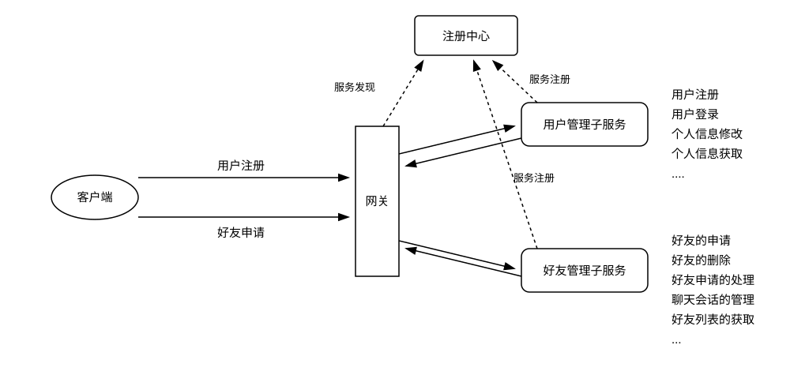
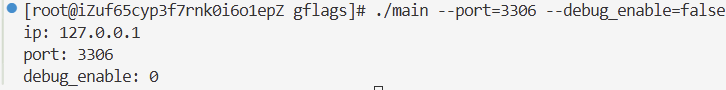
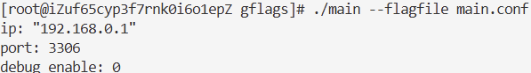
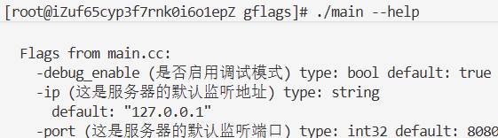
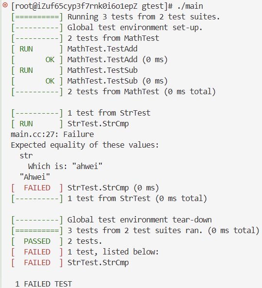
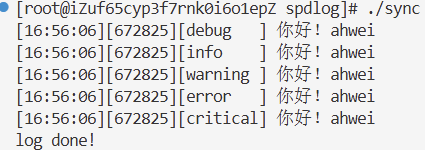
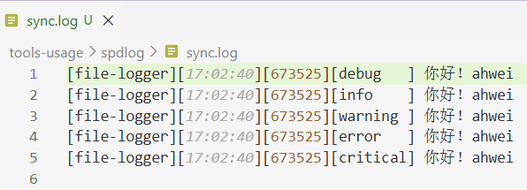
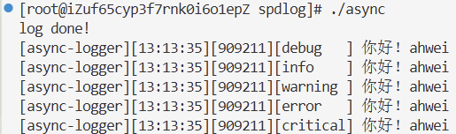
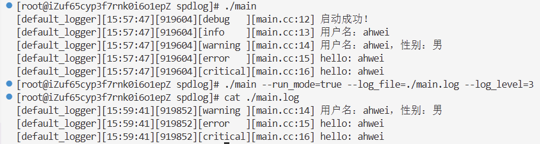
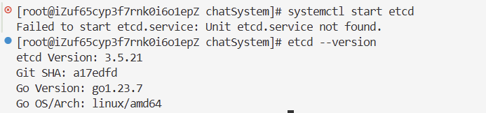

# chatSystem 开发文档

## 一、开发流程

后台服务器实现：

1. 功能需求确定阶段
   1. 要做什么，实现什么项目
   2. 实现这个项目，需要内部拥有哪些功能
2. 设计阶段
   1. 概要框架设计
   2. 功能模块接口设计
3. 技术调研，搭建开发环境阶段
   1. 确定使用哪些技术框架/库，了解他们的基础使用
   2. 将开发环境搭建起来
4. 具体实现阶段
5. 单元测试阶段：确定每一个模块的实现没有问题
6. 系统联调阶段

## 二、功能需求阶段

1. 用户注册
2. 用户登陆
3. 个人信息获取
4. 个人信息修改：
   1. 签名修改
   2. 绑定手机号修改
   3. 头像修改
   4. 昵称修改
5. 手机验证码获取
6. 手机号注册与登录
7. 用户搜索
8. 申请好友
9. 获取好友申请列表
10. 处理好友申请列表
11. 获取聊天会话列表
12. 发送新消息（文本消息，图片消息，语音消息，文件消息）
13. 获取历史消息-按时间
14. 获取最近消息-按条数
15. 关键字消息搜索
16. 文件的上传与下载
17. 语音转文字
18. 创建群聊

## 三、设计阶段

微服务：将一个大的业务拆分为多个子业务，分别在多台不同机器节点上提供对应的服务，由网关服务统一接收多个客户端的各种不同请求，然后将请求分发到不同的子服务节点上进行处理，获取相应后，再转发给客户端。



1. **服务拆分**：将应用程序拆分成多个小型服务，每个服务负责一部分业务功能，具有独立的生命周期和部署。
2. **独立部署**：每个微服务可以独立于其他服务进行部署、更新和扩展。
3. **语言和数据的多样性**：不同的服务可以使用不同的编程语言和数据库，根据服务的特定需求进行技术选型。
4. **轻量级通信**：服务之间通过定义良好的 API 进行通信，通常使用 HTTP/REST、gRPC 等协议。
5. **去中心化治理**：每个服务可以有自己的开发团队，拥有自己的技术栈和开发流程。
6. **弹性和可扩展性**：微服务架构支持服务的动态扩展和收缩，以适应负载的变化。
7. **容错性**：设计时考虑到服务可能会失败，通过断路器、重试机制等手段提高系统的容错性。
8. **去中心化数据管理**：每个服务管理自己的数据库，数据在服务之间是私有的，这有助于保持服务的独立性。
9. **自动化部署**：通过持续集成和持续部署（CI/CD）流程自动化服务的构建、测试和部署。
10. **监控和日志**：对每个服务进行监控和日志记录，以便于跟踪问题和性能瓶颈。
11. **服务发现**：服务实例可能动态变化，需要服务发现机制来动态地找到服务实例。
12. **安全**：每个服务需要考虑安全问题，包括认证、授权和数据传输的安全性。

## 四、环境搭建

### 4.1 gflags

gflags 是 Google 开源的 C++ 命令行参数解析库，专门用来给 C++ 程序灵活解析启动命令行参数，替代 C 语言原生 argc/argv 手动解析参数的繁琐写法。

#### 4.1.1 gflags 的安装

```shell
yum install gflags gflags-devel
```

> 1. 只在终端命令行执行软件：不管哪个系统，直接原名安装
> 2. 运行别人编译好的二进制文件，Ubuntu：装 `libxxx` 运行库；CentOS：普通 `yum install xxx` 自带动态库
> 3. 自己编译 C/C++ 源码：
>    1. Ubuntu：包名 = `lib库名-dev`
>    2. CentOS：包名 = `库名-devel`

#### 4.1.2 gflags 的使用

1. 包含头文件

   ```cpp
   #include <gflags/gflags.h>
   ```
2. 定义参数
   利用 `gflags `提供的宏来定义参数。该宏的三个参数分别为命令行参数名，参数默认值，参数的帮助信息。例如：

   ```c++
   DEFINE_bool(reuse_addr, true, "是否开始网络地址重用选项"); 
   DEFINE_int32(log_level, 1, "日志等级：1-DEBUG, 2-WARN, 3-ERROR"); 
   DEFINE_string(log_file, "stdout", "日志输出位置设置，默认为标准输出");
   ```

   `gflags` 支持定义多种类型的宏函数：

   ```cpp
   DEFINE_bool 
   DEFINE_int32 
   DEFINE_int64 
   DEFINE_uint64 
   DEFINE_double 
   DEFINE_string 
   ```
3. 访问参数

   变量固定前缀 `FLAGS_` + 参数名
4. 不同文件访问参数
   A.cc 定义了 `DEFINE_int32(port, 8080, "xxx");`
   B.cc 要读取它，用 `DECLARE_`：

   ```cpp
   DECLARE_int32(port);
   // 之后就能 FLAGS_port 使用
   ```
5. 初始化参数

   ```cpp
   google::ParseCommandLineFlags(&argc, &argv, true);
   ```
6. 运行参数

   `gflags` 也可以直接在命令行中设置运行参数：

   
7. 配置文件

   [配置文件](./tools-usage/gflags/main.conf) 不需要每次运行的时候都手动收入每个参数的数值，而是通过配置文件，一次编写，永久使用。注意配置文件中不要加多余的空格。

   
8. 特殊参数标识

   gflags也默认为我们提供了几个特殊的标识。

   ```bash
   --help  # 显示文件中所有标识的帮助信息 
   --helpfull  # 和-help 一样, 帮助信息更全面一些 
   --helpshort  # 只显示当前执行文件里的标志 
   --helpxml  # 以 xml 方式打印，方便处理 
   --version  # 打印版本信息，由 google::SetVersionString()设定
   --flagfile  -flagfile=f #从文件 f 中读取命令行参数 
   ```

   例如：

   

### 4.2 gtest

`gtest` 是一个跨平台的 `C++` 单元测试框架

#### 4.2.1 gtest 的安装

```shell
um install gtest-devel
```

#### 4.2.2 gtest 的使用

1. 包含头文件

   ```cpp
   #include <gtest/gtest.h>
   ```
2. 框架初始化

   ```cpp
   testing::InitGoogleTest(&argc, argv);
   ```
3. 调用测试样例

   ```cpp
   RUN_ALL_TESTS();
   ```
4. TEST 宏

   ```cpp
   TEST(测试名称, 测试样例名称)
   TEST_F(test_fixture,test_name)
   ```

   1. TEST：主要用来创建一个简单测试，它定义了一个测试函数，在这个函数中可以使用任何C++代码并且使用框架提供的断言进行检查
   2. TEST_F：主要用来进行多样测试，适用于多个测试场景如果需要相同的数据配置的情况，即相同的数据测不同的行为
5. 断言宏

   GTest 中的断言宏可以分为两类：

   * `ASSERT_`系列：如果当前检测点失败，则直接退出当前测试用例函数
   * `EXPECT_`系列：如果当前检测点失败，仅打印错误信息，继续向后执行剩余代码

   ```cpp
   // bool 值检查
   ASSERT_TRUE(参数);  // 期待表达式结果为 true
   ASSERT_FALSE(参数); // 期待表达式结果为 false

   // 数值型数据检查
   ASSERT_EQ(参数1, 参数2);  // equal，两个值相等才判定通过
   ASSERT_NE(参数1, 参数2);  // not equal，两个值不相等才判定通过
   ASSERT_LT(参数1, 参数2);  // less than，参数1 < 参数2 才判定通过
   ASSERT_GT(参数1, 参数2);  // greater than，参数1 > 参数2 才判定通过
   ASSERT_LE(参数1, 参数2);  // less equal，参数1 ≤ 参数2 才判定通过
   ASSERT_GE(参数1, 参数2);  // greater equal，参数1 ≥ 参数2 才判定通过
   ```

示例：

```cpp
#include <gtest/gtest.h> 

int Add(int a, int b) 
{
    return a + b;
}
int Sub(int a, int b) 
{
    return a - b;
}
// TEST(测试名称, 测试用例名称)
TEST(MathTest, TestAdd) 
{
    EXPECT_EQ(Add(1,2), 3);
    ASSERT_EQ(Add(-1, 1), 0);
}

TEST(MathTest, TestSub) 
{
    EXPECT_EQ(Sub(5,3), 2);
    EXPECT_EQ(Sub(2,7), -5);
}

TEST(StrTest, StrCmp)
{
    std::string str = "ahwei";
    ASSERT_EQ(str, "Ahwei");
    ASSERT_EQ(str, "ahwei");
}

int main (int argc, char* argv[])
{
    // 单元测试框架的初始化
    testing::InitGoogleTest(&argc, argv);
    // 开始所有的单元测试
    return RUN_ALL_TESTS(); 
}
```

运行结果如下：


### 4.3 Spdlog

高性能异步日志库

> * 同步日志：调用打印日志的代码时，当前线程立即执行磁盘写入、控制台 IO 操作，IO 没写完，业务代码就卡在这里等着，不能继续往下跑；
> * 异步日志：调用日志接口只把日志字符串丢进内存队列，立刻返回，业务线程马上继续执行业务逻辑。后台独立日志线程专门负责把队列里的日志批量写到文件或控制台，业务线程不用等待 IO。（生产者-消费者模型）

#### 4.3.1 Spdlog 的安装

```powershell
yum install spdlog-devel
```

#### 4.3.2 Spdlog 的使用

- 标准输出

  ```cpp
  #include <spdlog/spdlog.h>
  #include <spdlog/sinks/stdout_color_sinks.h>
  #include <iostream>

  int main()
  {
      // 设置全局的刷新策略
      spdlog::flush_every(std::chrono::seconds(1));       // 每秒刷新
      spdlog::flush_on(spdlog::level::level_enum::debug); // 遇到debug以上等级立即刷新
      // 设置全局的日志输出等级（每个日志器还可以独立进行设置）
      spdlog::set_level(spdlog::level::level_enum::debug);

      // 创建同步日志器（工厂接口默认创建的就是同步日志器）
      auto logger = spdlog::stdout_color_mt("default-logger");       // 标准输出
      // 设置日志器的刷新策略，以及日志器的输出等级
      logger->flush_on(spdlog::level::level_enum::debug);
      logger->set_level(spdlog::level::level_enum::debug);

      // 设置日志输出格式
      logger->set_pattern("[%n][%H:%M:%S][%t][%-8l] %v"); // -8：格式化对齐规则：左对齐，固定占 8 个字符宽度
      // 进行简单的日志输出
      logger->trace("你好！{}", "ahwei");
      logger->debug("你好！{}", "ahwei");
      logger->info("你好！{}", "ahwei");
      logger->warn("你好！{}", "ahwei");
      logger->error("你好！{}", "ahwei");
      logger->critical("你好！{}", "ahwei");
      std::cout << "log done!" << std::endl;

      return 0;
  }
  ```

  
- 输出到文件

  ```cpp
  #include <spdlog/spdlog.h>
  #include <spdlog/sinks/stdout_color_sinks.h>
  #include <spdlog/sinks/basic_file_sink.h>
  #include <iostream>

  int main()
  {
      // 设置全局的刷新策略
      spdlog::flush_every(std::chrono::seconds(1));       // 每秒刷新
      spdlog::flush_on(spdlog::level::level_enum::debug); // 遇到debug以上等级立即刷新
      // 设置全局的日志输出等级（每个日志器还可以独立进行设置）
      spdlog::set_level(spdlog::level::level_enum::debug);

      // 创建同步日志器（工厂接口默认创建的就是同步日志器）
      // auto logger = spdlog::stdout_color_mt("default-logger");       // 标准输出
      auto logger = spdlog::basic_logger_mt("file-logger", "sync.log"); // 普通文件
      // 设置日志器的刷新策略，以及日志器的输出等级
      logger->flush_on(spdlog::level::level_enum::debug);
      logger->set_level(spdlog::level::level_enum::debug);

      // 设置日志输出格式
      logger->set_pattern("[%n][%H:%M:%S][%t][%-8l] %v"); // -8：格式化对齐规则：左对齐，固定占 8 个字符宽度
      // 进行简单的日志输出
      logger->trace("你好！{}", "ahwei");
      logger->debug("你好！{}", "ahwei");
      logger->info("你好！{}", "ahwei");
      logger->warn("你好！{}", "ahwei");
      logger->error("你好！{}", "ahwei");
      logger->critical("你好！{}", "ahwei");
      std::cout << "log done!" << std::endl;

      return 0;
  }
  ```

  
- 异步工厂

  ```cpp
  #include <spdlog/spdlog.h>
  #include <spdlog/sinks/stdout_color_sinks.h>
  #include <spdlog/sinks/basic_file_sink.h>
  #include <spdlog/async.h>
  #include <iostream>

  int main()
  {
      // 设置全局的刷新策略
      spdlog::flush_every(std::chrono::seconds(1));       // 每秒刷新
      spdlog::flush_on(spdlog::level::level_enum::debug); // 遇到debug以上等级立即刷新
      // 设置全局的日志输出等级（每个日志器还可以独立进行设置）
      spdlog::set_level(spdlog::level::level_enum::debug);

      // 创建异步日志器
      auto logger = spdlog::stdout_color_mt<spdlog::async_factory>("async-logger");       // 标准输出
      // 设置日志器的刷新策略，以及日志器的输出等级
      logger->flush_on(spdlog::level::level_enum::debug);
      logger->set_level(spdlog::level::level_enum::debug);

      // 设置日志输出格式
      logger->set_pattern("[%n][%H:%M:%S][%t][%-8l] %v"); // -8：格式化对齐规则：左对齐，固定占 8 个字符宽度
      // 进行简单的日志输出
      logger->trace("你好！{}", "ahwei");
      logger->debug("你好！{}", "ahwei");
      logger->info("你好！{}", "ahwei");
      logger->warn("你好！{}", "ahwei");
      logger->error("你好！{}", "ahwei");
      logger->critical("你好！{}", "ahwei");
      std::cout << "log done!" << std::endl;

      return 0;
  }
  ```

  可以看到先输出日志打印完毕，后输出日志：

  

#### 4.3.3 Spdlog 的二次封装

原因：

1. 避免单例模式的锁冲突，因此直接创建全局的线程安全的日志器进行使用
2. 因为日志输出没有文件名行号，因此使用宏进行二次封装输出日志的文件名和行号
3. 封装一个初始化接口，便于使用：调试模式则输出到标准输出，否则输出到文件中
   思想：
4. 封装一个全局接口，用户日志器的创建与初始化
   - 初始化接口接收一个参数：运行模式-`bool`
   - 初始化接口接收一个参数：输出文件名-用于发布模式
   - 初始化接口接收一个参数：输出日志等级-用于发布模式
5. 对日志输出的接口，进行宏的封装，加入文件名行号的输出

logger.hpp:

```cpp
#include <spdlog/spdlog.h>
#include <spdlog/sinks/stdout_color_sinks.h>
#include <spdlog/sinks/basic_file_sink.h>
#include <spdlog/async.h>
#include <iostream>

std::shared_ptr<spdlog::logger> g_default_logger;

// mode - 运行模式： true-发布模式； false-调试模式
void init_logger(bool mode, const std::string &file, int level) 
{
    // 如果是调试模式，则创建标准输出日志器，输出等级为最低
    if (mode == false)
    {
        g_default_logger = spdlog::stdout_color_mt("default_logger");
        g_default_logger->set_level(spdlog::level::level_enum::trace);
        g_default_logger->flush_on(spdlog::level::level_enum::trace);
    }
    // 否则是发布模式，则创建文件输出日志器，输出等级根据参数而定
    else
    {
        g_default_logger = spdlog::basic_logger_mt("default_logger", file);
        g_default_logger->set_level((spdlog::level::level_enum)level);
        g_default_logger->flush_on((spdlog::level::level_enum)level);
    }
    g_default_logger->set_pattern("[%n][%H:%M:%S][%t][%-8l]%v"); 
}

#define LOG_TRACE(format, ...) g_default_logger->trace(std::string("[{}:{}] ") + format, __FILE__, __LINE__, ##__VA_ARGS__)
#define LOG_DEBUG(format, ...) g_default_logger->debug(std::string("[{}:{}] ") + format, __FILE__, __LINE__, ##__VA_ARGS__)
#define LOG_INFO(format, ...) g_default_logger->info(std::string("[{}:{}] ") + format, __FILE__, __LINE__, ##__VA_ARGS__)
#define LOG_WARN(format, ...) g_default_logger->warn(std::string("[{}:{}] ") + format, __FILE__, __LINE__, ##__VA_ARGS__)
#define LOG_ERROR(format, ...) g_default_logger->error(std::string("[{}:{}] ") + format, __FILE__, __LINE__, ##__VA_ARGS__)
#define LOG_FATAL(format, ...) g_default_logger->critical(std::string("[{}:{}] ") + format, __FILE__, __LINE__, ##__VA_ARGS__)
```

main.cc:

```cpp
#include "logger.hpp"
#include <gflags/gflags.h>

DEFINE_bool(run_mode, false, "程序的运行模式，false-调试；true-发布");
DEFINE_string(log_file, "", "发布模式下，用于指定日志输出文件");
DEFINE_int32(log_level, 0, "发布模式下，用于指定日志输出等级");
int main(int argc, char* argv[])
{
    google::ParseCommandLineFlags(&argc, &argv, true);
    init_logger(FLAGS_run_mode, FLAGS_log_file, FLAGS_log_level);

    LOG_DEBUG("启动成功！");
    LOG_INFO("用户名：{}", "ahwei");
    LOG_WARN("用户名：{}，性别：{}", "ahwei", "男");
    LOG_ERROR("hello: {}", "ahwei");
    LOG_FATAL("hello: {}", "ahwei");

    return 0;
}
```



### 4.4 etcd

Etcd 是一个分布式、高可用的一致性键值存储系统，用于配置共享和服务发现等。使用 Raft 一致性算法来保持集群数据的一致性，且客户端通过长连接 watch 功能，能够及时收到数据变化通知。

- Lease 租约 + KeepAlive 心跳：实现临时节点自动清理，服务宕机自动注销注册信息；
- 分布式锁：基于 CAS 原子事务实现，搭配租约避免死锁；
- 事务、版本控制：支持条件原子写入、历史数据回滚。

#### 4.4.1 etcd 的安装

1. 安装

   ```bash
   # 1. 下载etcd 3.5.21 amd64
   wget https://github.com/etcd-io/etcd/releases/download/v3.5.21/etcd-v3.5.21-linux-amd64.tar.gz

   # 2. 解压
   tar -zxvf etcd-v3.5.21-linux-amd64.tar.gz -C /usr/local/

   # 3. 把二进制放入系统PATH
   cd /usr/local/etcd-v3.5.21-linux-amd64
   cp etcd etcdctl /usr/local/bin/

   # 4. 验证安装
   etcd --version
   etcdctl version
   ```
2. 启动 Etcd 服务：

   ```bash
   systemctl start etcd
   ```

   > 开启的时候我这里报错了：
   > 
   > 这个报错的意思是：etcd 二进制已经安装了，但系统里没有注册 etcd.service，所以 systemctl start etcd 找不到服务单元。
   > 可以先确认路径：`which etcd`
   > 输出是 `/usr/local/bin/etcd`，可以手动创建 systemd 服务：
   >
   > ```
   > mkdir -p /var/lib/etcd
   >
   > cat >/etc/systemd/system/etcd.service <<'EOF'
   > [Unit]
   > Description=etcd key-value store
   > Documentation=https://etcd.io/docs/
   > After=network-online.target
   > Wants=network-online.target
   >
   > [Service]
   > Type=notify
   > ExecStart=/usr/local/bin/etcd \
   >   --name default \
   >   --data-dir /var/lib/etcd \
   >   --listen-client-urls http://0.0.0.0:2379 \
   >   --advertise-client-urls http://127.0.0.1:2379 \
   >   --listen-peer-urls http://127.0.0.1:2380 \
   >   --initial-advertise-peer-urls http://127.0.0.1:2380 \
   >   --initial-cluster default=http://127.0.0.1:2380 \
   >   --initial-cluster-state new
   > Restart=always
   > RestartSec=5
   > LimitNOFILE=40000
   >
   > [Install]
   > WantedBy=multi-user.target
   > EOF
   > ```
   >
3. 设置 Etcd 开机自启：

   ```bash
   sudo systemctl enable etcd
   ```
4. 运行验证：

   ```bash
   etcdctl put mykey "wjw" 
   etcdctl get mykey
   etcdctl del mykey
   ```

#### 4.4.2 搭建服务注册发现中心

使用 Etcd 作为服务注册发现中心，需要定义服务的注册和发现逻辑，这通常涉及到以下几个操作：

1. 服务注册：服务启动时，向 Etcd 注册自己的地址和端口
2. 服务发现：客户端通过 Etcd 获取服务的地址和窗口，用于远程调试
3. 健康检查：服务定期向 Etcd 发送心跳，以维持其注册信息的有效性

etcd 采用 golang 编写， v3 版本通信采用 grpc API，即（HTTP2 + protobuf），官方只维护了 go 语言版本的 client 库，因此需要找到 C/C++ 非官方的 client 开发库 `etcd-cpp-apiv3`

### 4.5 brpc

### 4.6 es

### 4.7 httplib

### 4.8 websocketpp

### 4.9  redis

### 4.10 ODB

### 4.11 RabbitMQ

### 4.12 DMS

### 4.13 语音平台

### 4.14 cmake
